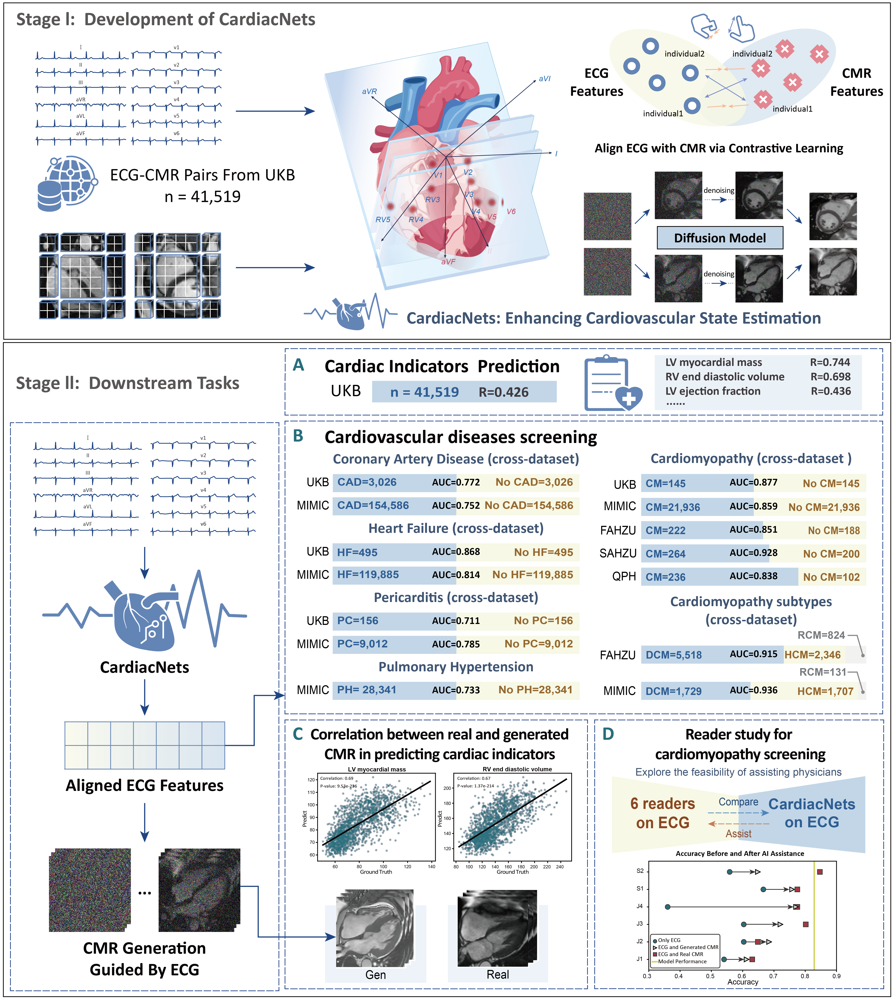

# CardiacNets
This is the official implementation of our paper Large-scale cross-modality pretrained model enhances cardiovascular state estimation and cardiomyopathy detection from electrocardiograms: An AI system development and multi-center validation study.


## Abstract
Cardiovascular diseases (CVDs) present significant challenges for early and accurate diagnosis. While cardiac magnetic resonance imaging (CMR) is the gold standard for assessing cardiac function and diagnosing CVDs, its high cost and technical complexity limit accessibility. In contrast, electrocardiography (ECG) offers promise for large-scale early screening. This study introduces CardiacNets, an innovative framework that enhances ECG analysis by leveraging the diagnostic strengths of CMR through cross-modal contrastive learning and generative pretraining. CardiacNets serves two primary functions: (1) it evaluates detailed cardiac function indicators and screens for potential CVDs, and (2) it enhances interpretability by generating high-quality CMR images from ECG data. Our findings demonstrate that CardiacNets significantly outperforms traditional ECG-only models across extensive datasets, substantially improving screening accuracy. Furthermore, the generated CMR images provide valuable diagnostic support for physicians of all experience levels. This proof-of-concept study highlights how ECG can facilitate cross-modal insights into cardiac function assessment, paving the way for enhanced CVD screening and diagnosis at a population level.
## Environment Set Up
Install required packages:
```bash
conda create -n mmcl python=3.8
conda activate mmcl
pip install -r SSL_Contrastive_Model/requirements.txt

conda create -n vgen python=3.8
conda activate vgen
pip install -r ECG2CMR_DiffsionModel/requirements.txt
```
## Citation
If you find our paper/code useful, please consider citing our work:
```
@misc{ding2024largescalecrossmodalitypretrainedmodel,
      title={Large-scale cross-modality pretrained model enhances cardiovascular state estimation and cardiomyopathy detection from electrocardiograms: An AI system development and multi-center validation study}, 
      author={Zhengyao Ding and Yujian Hu and Youyao Xu and Chengchen Zhao and Ziyu Li and Yiheng Mao and Haitao Li and Qian Li and Jing Wang and Yue Chen and Mengjia Chen and Longbo Wang and Xuesen Chu and Weichao Pan and Ziyi Liu and Fei Wu and Hongkun Zhang and Ting Chen and Zhengxing Huang},
      year={2024},
      eprint={2411.13602},
      archivePrefix={arXiv},
      primaryClass={eess.IV},
      url={https://arxiv.org/abs/2411.13602}, 
}
```
