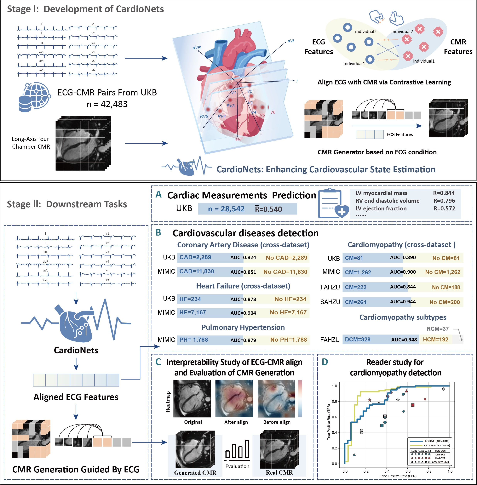

# CardioNets

This is the official implementation of our paper Generating Cardiac Magnetic Resonance Images from Electrocardiograms — A Multicenter Study.



## Abstract

**BACKGROUND:**
Cardiovascular disease (CVD) requires early and accurate diagnosis to improve outcomes. Cardiac magnetic resonance (CMR) imaging provides gold-standard functional and structural insights but remains limited by accessibility and complexity. Electrocardiogram (ECG) is widely available but lacks CMR’s granularity. We propose CardioNets, a deep learning framework that translates 12-lead ECG into CMR-aligned functional parameters and synthetic images, enabling scalable, low-cost cardiac assessment.
**METHODS:**
CardioNets aligns the ECG with CMR-derived latent representations via crossmodal contrastive learning, then generates CMR images from the ECG using masked autoregressive modeling. The study utilized 159,819 samples from the XXX, the Medical Information Mart for Intensive Care (MIMIC) IV ECG database, and two external clinical datasets for model development and evaluation. The performance in cardiac measurement regression and disease detection was evaluated against ECG-only and CMR-based baseline models, and the synthesized CMR image quality was compared with state-of-the-art methods. A reader study compared CardioNets with physicians using ECG and clinically acquired CMR images.
**RESULTS:**
In the XXX dataset, CardioNets improved cardiac measurement regression (R2=0.310; 95% confidence interval [CI], 0.304 to 0.315) compared with the best ECG baseline (R2=0.269; 95% CI, 0.265 to 0.272; P<0.0001). For cardiomyopathy detection, CardioNets achieved an area under the receiver operator curve (AUROC) of 0.890 (95% CI, 0.836 to 0.944), outperforming the best ECG baseline (AUROC=0.867; 95% CI, 0.812 to 0.921; P<0.01), and demonstrating performance comparable to a CMR-based model (AUROC=0.906; 95% CI, 0.890 to 0.922; P=0.514). In MIMIC-IV for pulmonary hypertension detection, CardioNets (AUROC=0.879; 95% CI, 0.853 to 0.903) outperformed the best ECG baseline (AUROC=0.853; 95% CI, 0.824 to 0.881; P<0.001). Synthesized CMR images by CardioNets achieved a structural similarity index measure of 0.205 (95% CI, 0.202 to 0.208), outperforming the state-of-the-art method (0.122; 95% CI, 0.120 to 0.125; P<0.0001). In the reader study, CardioNets achieved an accuracy of 0.874 (95% CI, 0.800 to 0.923), outperforming participating readers.
**CONCLUSIONS:**
CardioNets translates ECGs into CMRlevel insights, improving CVD detection performance and enabling scalable accessibility. Prospective studies are warranted to validate clinical deployment. (Funded by the National Key Research and Development Program of China and others.).

## Environment Set Up

Install required packages:

```bash
conda env create -f environment.yml
```

Activate the newly created environment

## Example datasets and pretrained weights

Here is the example data, weights, and example run code for the two tasks of CardioNets: 

### A. ECG2CMR autoregression generative model

The model weights can be accessed from the following OneDrive folder:

The folder **generation** contains the following files:

* **checkpoint-0004.pth** (Autoencoder(VAE) weights, to compress CMR to latent space)
* **checkpoint-last.pth** (Masked autoregression generative model weights)
* **aligned_ECG_encoder.pth** (ECG feature encoder)

To quickly use the ECG-guided CMR generation model, we have provided a simple startup script.

* Download these three files and place them in the **CMR_generation/model_weight/** directory.
  And run the following command to execute the script:

```
python CMR_generation/simple_generate.py 
```

Upon running the script, the generated CMR files in **nii** format will be saved in the **CMR_generation/example_data** directory.

### B. Downstream task with aligned ECG model

The second part of our model involves fine-tuning the aligned ECG encoder for downstream tasks. We perform full fine-tuning for each downstream task, and here we provide an example using MIMIC data and weights for cardiomyopathy prediction.

The data and model weights can be accessed at the folder **DownstreamTask** contains the following files:

* **trained_by_MIMIC_CM_best-auc.pth** (ECG model for binary classification of cardiomyopathy)
* **cm_mimic_test.pkl** (Cardiomyopathy sample data)

Setup Instructions:

* Download these two files and place them in the **Example_downstreamTask/** directory.

run the following command to obtain the same CardioNets cardiomyopathy classification results in MIMIC as shown in the paper (Fig. 3b):

```
python example_main_Cla_mimic_downstream.py
```

Upon running the script, the results will be saved in **Example_downstreamTask directory/**

## Citation

If you find our paper/code useful, please consider citing our work: Ding Z, Li Z, Hu Y, et al. Generating Cardiac Magnetic Resonance Images from Electrocardiograms—A Multicenter Study[J]. NEJM AI, 2026, 3(4)
